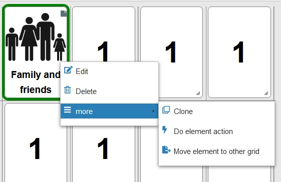
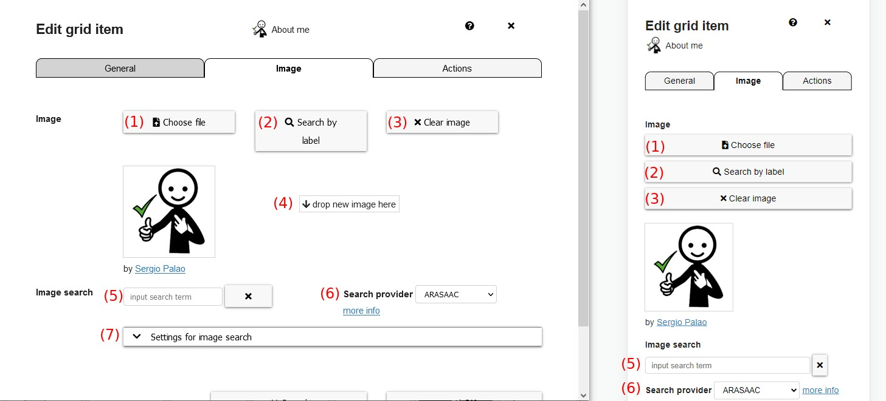
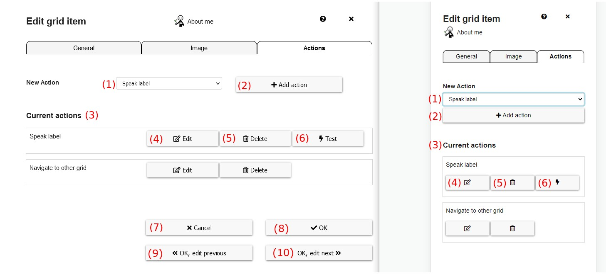

# Grid appearance and layout

**Videos on YouTube:** [Layout options](https://www.youtube.com/watch?v=Iw605fb85bs&list=PL0UXHkT03dGrIHldlEKR0ZWfNMkShuTNz&index=12&t=0s), [Collect elements](https://www.youtube.com/watch?v=X6YrWJW2ZoM&list=PL0UXHkT03dGrIHldlEKR0ZWfNMkShuTNz&index=21&t=0s), [Prediction elements](https://www.youtube.com/watch?v=t0FWZcM9TMg&list=PL0UXHkT03dGrIHldlEKR0ZWfNMkShuTNz&index=22&t=0s) (German, but auto-translated subtitles available)

This chapter is about a grid's layout and appearance and how to edit it:

1. [Adding elements and change the layout](03_appearance_layout.md#adding-elements-and-layout-options)
2. [Editing grid elements menu](03_appearance_layout.md#editing-grid-elements)
3. [Edit modal](03_appearance_layout.md#edit-grid-item-modal): changing label and image

[Back to Overview](README.md)

## Adding elements and layout options

In the [Edit view ("Editing on")](02_navigation.md#edit-view) the following menu opens on a click on "more":

*Fig. 1: Edit view - menu "more"*

These are the actions to select in the menu:

1. **New &#x2192; New Element**: creates a normal new element, opening a dialog where label and image can be defined
2. **New &#x2192; Many new elements**: creates multiple new normal elements at once, opening a dialog where multiple elements can be defined and inserted into the grid
3. **New &#x2192; New collect element**: creates a new collect element, see [Terms](01_terms.md#grid-element)
4. **New &#x2192; New prediction element**: creates a new prediction element, see [Terms](01_terms.md#grid-element)
5. **New → New YouTube Player**: creates a new YouTube Player element
6. **Delete all elements**: removes all grid elements from the grid
7. **Change grid dimensions**: set grid size (number of rows and minimum number of columns)
8. **Translate grid**: select which grid(s) to translate and in which language the texts shall be translated
9. **Fill gaps**: moves all grid elements as far left as possible, closing gaps as the following image shows:
   

10. **Edit global grid**: directly go to the page, where the global grid can be edited (otherwise go to *Manage grids → Edit global Grid* (at the bottom))

## Editing grid elements

A right click (or long tap) on a grid element in **edit view ("editing on")** opens the following menu:

*Fig. 2: Grid element menu in "Editing on" - view*

These are the options to select:

1. **Edit**: opens a dialog to edit the label and the image of this element ("Edit modal")
2. **Delete**: deletes this element
3. **More → Clone**: inserts a copy of this element to the grid
4. **More → Do element action**: performs the actions that are assigned to this grid element, e.g. speaking the label or navigating to another grid
5. **More → Move element to other grid**: moves the element to another grid which can be selected

## "Edit grid item" modal

**Video on YouTube:** [Add and edit elements](https://www.youtube.com/watch?v=KWwWgCgidXM&list=PL0UXHkT03dGrIHldlEKR0ZWfNMkShuTNz&index=13&t=0s) (German, but auto-translated subtitles available)

The "Edit"-modal is opened by a right click (or long tap) on a grid element in **edit view ("editing on")** and subsequent clicking on "Edit". The "Edit"-modal has three tabs (General, Image and Actions):

#### Tab "General"

Clicking on "Edit" in the grid element menu (Fig. 2) opens the following modal (Tab *General*) shown in Figure 3:

*Fig. 3: "Edit grid item" modal - Tab "General"*

These are the elements in the modal of Figure 3 (Edit grid item - Tab *General*):

1. **Label**: change the label of the element shown under the image, can be empty
2. **Color category**: choose the color category (Noun, Verb, etc.)
3. **Search for images**: change to the *Image*-Tab. 
4. **Costum background color**: choose a different backgroud color
5. **Hide element**: the element will only be visible in the "Editing on"-view. After clicking "Editing off", it will not be visible.
6. **Cancel**: discard all changes and close the modal
7. **OK**: save all changes and close the modal
8. **OK, edit previous**: save all changes, edit the previous grid element in the "Edit grid item" modal - Tab "General"
9. **OK, edit next**: save all changes, edit the next grid element in the "Edit grid item" modal - Tab "General"

#### Tab "Image"

*Fig. 4: "Edit grid item" modal - Tab "Image"*

1. **Choose file**: opens a file dialog to choose a different image
2. **Search by label**: image search is done by label
3. **Clear image**: deletes the currently chosen image
4. **Drop area**: drag and drop image files in this area to select them. It's possible to drag and drop files from a file explorer or also other programs like e.g. METACOM MetaSearch*.

5. **Image Search**: type in the name of which images shall be looked for
6. **Search Provider**: select the provider for the image search
7. **Settings for image search**: select additional settings like Plural or Color (skin color, hair color,...)

#### Tab "Actions"

*Fig. 5: "Edit grid item" modal - Tab "Actions"*

1. **New Action**: select type of new action in the combobox (e.g. Speak label, Navigate to other grid)
2. **Add action**: add the selected type of action to the grid
3. **Current actions**: actions currently assigned to the current grid element are shown here
4. **Edit**: open additional drop down menus to edit and configure the particular action
5. **Delete**: delete this action from the current grid element
6. **Test**: tests the action, e.g. speaks the label. This button is not available for all types of actions.
7. **Cancel**: discard all changes and close the modal
8. **OK**: save all changes and close the modal
9. **OK, edit previous**: save all changes, edit the previous grid element in the "Edit grid item" modal - Tab "Actions"
10. **OK, edit next**: save all changes, edit the next grid element in the "Edit grid item" modal - Tab "Actions"

<a href="https://www.metacom-symbole.de/" target="_blank">*METACOM and MetaSearch</a> &copy; Annette Kitzinger

[&#x2190; Previous Chapter](02_navigation.md) [Next Chapter &#x2192;](04_input_options.md)

[Back to Overview](README.md)
